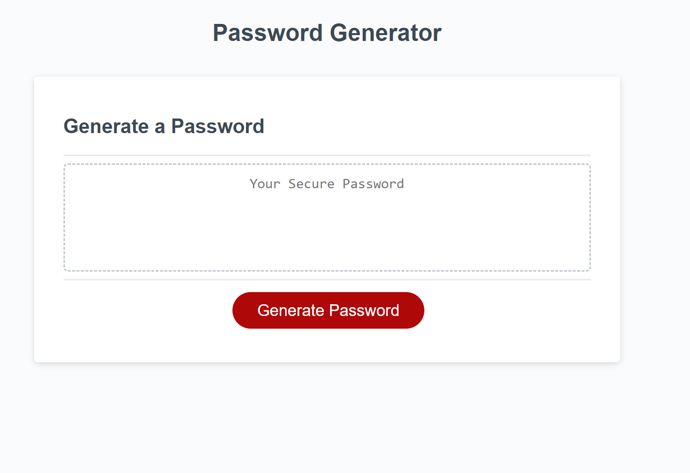

# Password-Gen

## Description
The main motivation behind this was to generate a webpage that would randomly configure a strong password for the user. Once the "Generate Password" button is clicked, it asks the user of series of questions as to if they would like any lowercase letters, uppercase letters, numbers, or special characters. Once the data is collected, a randomized password is generated on to the page for the user. I learned through this password generator project to demonstrate my Javascript skills as well as some WebAPIs skills to complete this project. I also learned that these languages take time to process and that a lot of coding is required to complete this project.

## Installation
https://github.com/Ericlee1783/Password-Gen This is the link to the actual code on Github
https://ericlee1783.github.io/Password-Gen/ This is the website link

## Usage
 
This is the screenshot of the password generator website. 